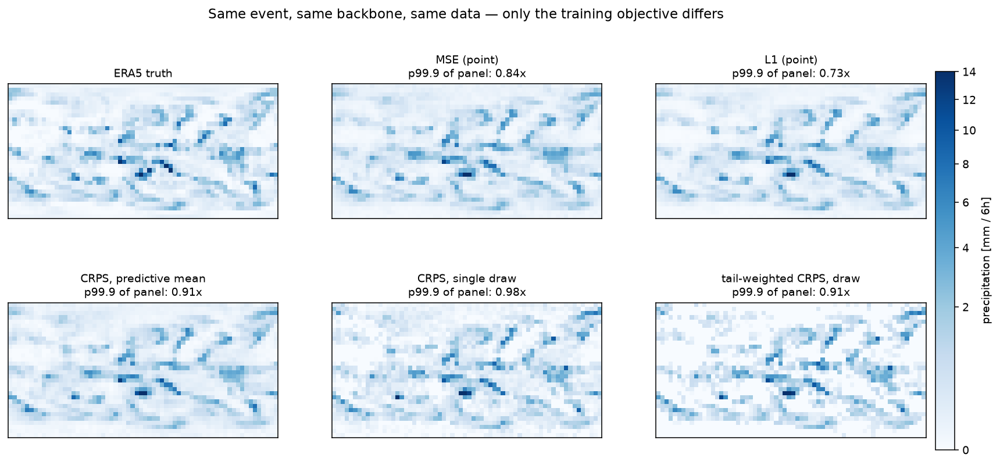
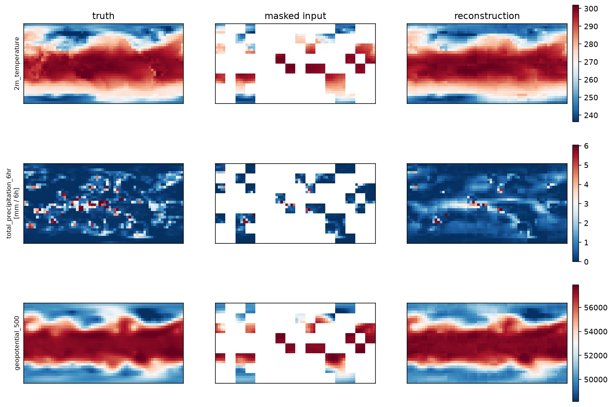

# cirrus

A small weather foundation model, built end to end — and used to study one
thing the large ones get wrong: **the tail**.

[](https://github.com/John-Amal/cirrus/actions/workflows/ci.yml)
[](https://huggingface.co/John-Amal/cirrus-mae-5625)

> **Status: Phase 4 complete.** A 5M-parameter ViT pretrained on 36 years of
> ERA5, precipitation heads fine-tuned on it to compare training objectives,
> and return levels evaluated on held-out years. Weights are on the
> [Hugging Face Hub](https://huggingface.co/John-Amal/cirrus-mae-5625).



*The same event, the same frozen backbone, the same data — only the
training objective differs. Note the first panel on the bottom row: the
CRPS model's predictive mean is as smooth as the deterministic arms above
it. The same model sampled, beside it, is not. The intensity is in the
distribution, not in the architecture.*

## The result

**Training a weather model with squared error implies that precipitation has
a maximum.** It does not.

Fitting a generalised Pareto to each model's implied climatology over
held-out years (2017–2022) recovers the shape parameter ξ, which governs how
the tail decays. Observations give ξ ≈ 0.00. Models trained with MSE and L1
give ξ = −0.09 and −0.13: **negative**, meaning a distribution with a finite
upper bound. Models trained with a proper scoring rule over a predictive
distribution give +0.06 to +0.07, close to observed.

The consequence, as a ratio of modelled to observed return level:

| objective | 1 year | 5 years | 20 years | fitted ξ |
| --- | --- | --- | --- | --- |
| L1 (point) | 0.72 | 0.66 | **0.62** | −0.134 |
| MSE (point) | 0.78 | 0.73 | **0.70** | −0.089 |
| CRPS (distribution) | 1.09 | 1.15 | 1.22 | +0.074 |
| tail-weighted CRPS | 1.05 | 1.09 | **1.14** | +0.060 |
| *observations* | *1.00* | *1.00* | *1.00* | *+0.002* |

Deterministic objectives miss the 20-year return level by 30–38%, and miss it
*worse the further out you go* — the signature of a bounded tail diverging
from an unbounded one. Distributional objectives stay roughly flat across
return periods.

The ordering holds under three different treatments of the shape parameter
and across three seeds. Observed return levels carry block-bootstrap
intervals of ±12% to ±21%, so the deterministic deficit is established while
the distributional arms' small excess is not distinguishable from zero.

Full tables, the stationarity check and the caveats:
[`docs/results/phase4.md`](docs/results/phase4.md).

### Phase 3: where the difference comes from

Six heads, one frozen backbone, differing only in their objective. Squared
error is minimised by predicting the conditional mean, so a model that cannot
place an event exactly is rewarded for spreading it out. A proper scoring
rule over a predictive distribution removes that incentive.

| objective | p99.9 amplitude ratio | MAE (mm) | exceedance Brier |
| --- | --- | --- | --- |
| L1 (point) | 0.74 | **0.314** | 0.0176 |
| MSE (point) | 0.82 | 0.333 | 0.0180 |
| CRPS (distribution) | 1.02 | 0.324 | **0.0136** |
| tail-weighted CRPS | **1.00** | 0.355 | 0.0137 |

The cost is 3% of bulk accuracy; the gain is a 24% better exceedance score
and a tail that exists. Tail weighting on top of that improves magnitude
calibration but not occurrence skill, and only in moderation.

Details: [`docs/results/phase3.md`](docs/results/phase3.md).

### Phase 2: why this was worth testing



*Masked-autoencoder reconstruction. The model places the ITCZ correctly but
smears it: the truth has isolated convective maxima, the reconstruction has a
smooth ribbon. Squared error rewards exactly that.*

Pretraining reached 0.2385 validation MSE against ~1.0 for predicting the
mean, with skill tracking atmospheric predictability — geopotential at
250 hPa 0.021, precipitation 0.618. But its precipitation reconstructions
were unbiased in the space the loss was computed in (mean ratio 1.00) and
30% of the true intensity at the 99.9th percentile in millimetres. The loss
was nearly flat exactly where the extremes were, which is what Phase 3 set
out to fix.

## Why this project

Large weather models (GraphCast, Aurora, AIFS) are trained by teams with
substantial compute. This repository implements the same pipeline at a scale
one person can train and, more importantly, fully explain: patch embedding,
attention, the masking scheme and the training loop are written out rather
than imported, and checked against reference implementations.

The distinguishing piece is the treatment of extremes. Published evaluations
find that AI weather models underestimate both the frequency and intensity of
record-breaking events, and ECMWF attributes AIFS's under-prediction of heavy
precipitation partly to smoothing from its MSE loss. Work adapting foundation
models for extremes mostly still trains with bulk losses. `cirrus` tests
whether an extreme-value-informed objective changes that, at a scale where
the experiment can actually be run.

## Quickstart

```bash
git clone https://github.com/John-Amal/cirrus.git && cd cirrus
python -m venv .venv && source .venv/bin/activate
pip install -e ".[dev]"

cirrus device                                    # cuda -> mps -> cpu
cirrus ingest --config configs/data/era5_5625.yaml --dry-run
```

The full pipeline, from nothing to a trained model:

```bash
cirrus ingest    # ~11 GB of ERA5 from WeatherBench 2, resumable
cirrus stats     # latitude-weighted normalisation, training years only
cirrus pretrain  # ~8 min/epoch on an M-series laptop
cirrus inspect   # per-variable scores and the reconstruction figure
```

## How it works

| Stage | What it does |
|---|---|
| `data/ingest` | Pulls ERA5 at 5.625°, validating variables before downloading; resumable |
| `data/normalise` | Latitude-weighted, training-years-only statistics; `log1p` for precipitation |
| `data/windows` | Samples that never cross split boundaries or time gaps |
| `data/augment` | Longitude roll, paired with a solar-time shift so the diurnal cycle stays honest |
| `models/attention` | Multi-head attention written out, tested against PyTorch's fused version |
| `models/mae` | 75% masking, lightweight decoder, latitude-weighted loss on hidden patches only |
| `eval/reconstruction` | Per-variable scores and the tail-amplitude diagnostic |

At 5.625° the grid is 32×64, so 4×4 patches give 128 tokens — small enough
for full attention and for a laptop.

## Roadmap

| Phase | Content | Status |
| --- | --- | --- |
| 0 | Scaffolding, CI, training loop on synthetic data | done |
| 1 | ERA5 pipeline, normalisation, windowing, augmentation | done |
| 2 | Masked-autoencoder pretraining, published weights | done |
| 3 | Extremes head, four objectives compared across seeds | done |
| 4 | GPD return levels on held-out years, shape-parameter robustness | done |
| 5 | Export, serving, LLM agent interface | |

Still open: NWP and climatology baselines, and out-of-distribution
evaluation on warm-climate storyline simulations, which tests whether a
model trained on the historical record can represent intensified extremes.

## Development

```bash
pre-commit install
ruff check . && mypy src && pytest    # what CI runs, in order
```

The tests worth reading assert properties rather than absence of crashes:
that the hand-written attention matches PyTorch's fused implementation, that
patch ordering agrees between the tokeniser and the loss targets, that the
longitude roll preserves local solar time, and that a sample window never
crosses a train/test boundary.

Design decisions and negative results, including the bugs, are recorded in
[`docs/experiments.md`](docs/experiments.md).

## Data

ERA5 reanalysis via [WeatherBench 2](https://weatherbench2.readthedocs.io/),
conservatively regridded to 64×32. Contains modified Copernicus Climate
Change Service information (1979–2014); neither the European Commission nor
ECMWF is responsible for any use of it.

## Related work by the author

- [Climate Risk Explorer](https://github.com/John-Amal) — end-to-end Swiss
  climate risk pipeline and dashboard.
- `catagg` — open-source catastrophe loss aggregation (ELT to OEP/AEP curves).

## Licence

MIT.
