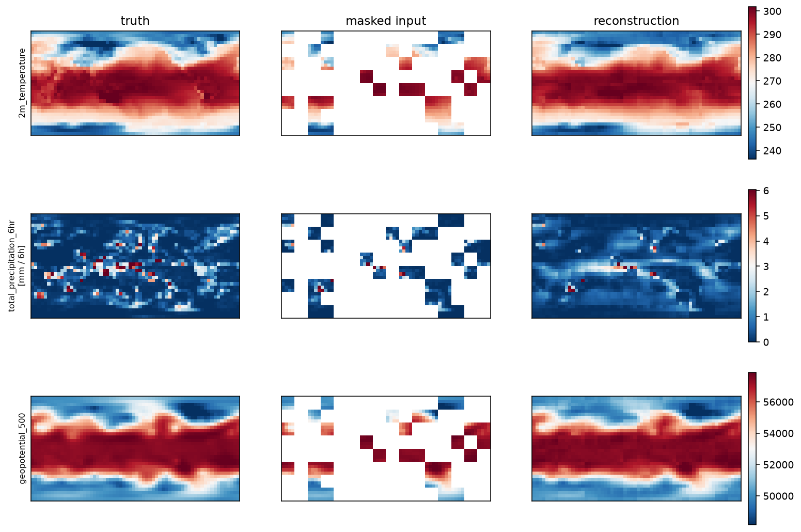

# cirrus-mae-5625

A small masked-autoencoder foundation model for global atmospheric fields,
pretrained on ERA5 at 5.625 degrees. Roughly 5M parameters, trained from
scratch on a laptop in under three hours.

This is the pretrained backbone from
[`cirrus`](https://github.com/John-Amal/cirrus), a research project studying
how training objectives shape the representation of **extremes** in
data-driven weather models. It is released as a reproducible, inspectable
baseline, not as a competitor to operational systems.



## What it is

| | |
|---|---|
| Architecture | ViT encoder, 6 layers, width 256, 8 heads |
| Parameters | 4,993,280 (encoder); decoder discarded after pretraining |
| Input | 32x64 global grid (5.625 deg), 2 timesteps, 27 channels each |
| Tokens | 128 (4x4 patches) |
| Objective | Masked autoencoding, 75% of patches hidden |
| Loss | Latitude-weighted MSE on masked patches, dynamic channels only |
| Training data | ERA5 1979-2014, 6-hourly (52,594 samples) |
| Validation | 2015-2016. 2017-2022 held out entirely |
| Compute | ~2.8 hours on an Apple Silicon laptop |

Input channels per timestep: 21 dynamic (2 m temperature, 10 m u/v wind,
mean sea-level pressure, 6-hourly total precipitation, total column water
vapour, and geopotential, temperature, specific humidity, u and v wind at
250/500/850 hPa), 2 static (surface geopotential, land-sea mask) and 4
time encodings (sine and cosine of day-of-year and hour).

## Results

Masked reconstruction MSE, normalised units, on held-out validation data.
Overall: **0.2385** (0.2234 training), against ~1.0 for predicting the
per-channel mean.

| Variable | MSE | | Variable | MSE |
|---|---|---|---|---|
| geopotential_250 | 0.021 | | u_component_of_wind_500 | 0.246 |
| geopotential_500 | 0.027 | | u_component_of_wind_250 | 0.246 |
| temperature_500 | 0.044 | | u_component_of_wind_850 | 0.251 |
| 2m_temperature | 0.047 | | 10m_u_component_of_wind | 0.281 |
| temperature_850 | 0.050 | | specific_humidity_250 | 0.317 |
| geopotential_850 | 0.067 | | specific_humidity_500 | 0.361 |
| total_column_water_vapour | 0.106 | | 10m_v_component_of_wind | 0.474 |
| temperature_250 | 0.120 | | v_component_of_wind_500 | 0.526 |
| specific_humidity_850 | 0.137 | | v_component_of_wind_850 | 0.528 |
| mean_sea_level_pressure | 0.153 | | v_component_of_wind_250 | 0.538 |
| | | | total_precipitation_6hr | 0.618 |

The ordering follows atmospheric predictability. Geopotential is smooth,
large-scale and balance-constrained, and reconstructs almost perfectly.
Meridional wind is about twice as hard as zonal wind at every level: zonal
wind has a strong climatology (the jets sit at predictable latitudes) while
meridional wind averages to near zero everywhere, so nearly all of its
variance is transient.

### The tail deficit

Precipitation over masked patches, pooled across validation batches:

| | log1p space (where the loss is computed) | | | physical (mm / 6h) | |
|---|---|---|---|---|---|
| | truth | predicted | ratio | truth | predicted | ratio |
| mean | 0.326 | 0.326 | **1.00** | 0.599 | 0.458 | 0.76 |
| p90 | 0.979 | 0.750 | 0.77 | 1.663 | 1.117 | 0.67 |
| p99 | 1.997 | 1.226 | 0.61 | 6.368 | 2.409 | 0.38 |
| p99.9 | 2.573 | 1.538 | 0.60 | 12.104 | 3.655 | **0.30** |
| max | 3.490 | 2.359 | 0.68 | 31.801 | 9.578 | 0.30 |

The model is **exactly unbiased in the space it was optimised in** (mean
ratio 1.00) and reproduces **30% of the intensity** of the most extreme
events in physical units.

Two mechanisms compound. Squared error is minimised by predicting the
conditional mean, so a model that cannot place an event exactly is rewarded
for spreading it out, and predictions are under-dispersed. That shrinkage is
then amplified by the inverse transform: at the 99.9th percentile a ~1.0
log-unit error — unremarkable to the loss — is the difference between
12.1 mm and 3.7 mm of rain.

This is a property of the objective, not a defect of this particular
checkpoint. Any head trained with mean-squared error on log-transformed
precipitation inherits it, however good the encoder.

## Intended use

- A pretrained encoder to fine-tune for downstream tasks on coarse-resolution
  global fields.
- A reproducible baseline for studying how training objectives affect the
  representation of extremes.
- Teaching and experimentation: the whole pipeline trains in hours on a
  laptop, and every component is written out rather than imported.

## Limitations

**Not a forecast model.** It was trained to reconstruct hidden patches of a
field it can partly see, not to predict the future. No forecast skill is
claimed and none has been measured. The numbers above are reconstruction
diagnostics.

**Coarse.** At 5.625 degrees a grid cell is a ~600 km area mean. Precipitation
intensities are far below point values, and small-scale phenomena are absent
by construction.

**Extremes are under-represented**, as quantified above. Do not use it where
tail amplitude matters without addressing this.

**Deterministic.** It produces a single field, with no uncertainty estimate.

**Trained on the historical climate.** Behaviour outside the 1979-2014
distribution is untested. Evaluation on warm-climate simulations is planned
but not done.

**Evaluated on a sample.** The diagnostics use 20 validation batches, not the
full record.

## Usage

```python
import torch
from huggingface_hub import hf_hub_download

from cirrus.models.vit import ViT, BackboneSpec  # pip install from the repo

path = hf_hub_download("John-Amal/cirrus-mae-5625", "cirrus-mae-5625.pt")
state = torch.load(path, map_location="cpu", weights_only=False)

backbone = ViT(
    in_channels=54,
    spec=BackboneSpec(**state["backbone_spec"]),
    grid=(32, 64),
)
backbone.load_state_dict(state["backbone"])
backbone.eval()

# fields: (batch, 54, 32, 64), normalised with the statistics in the repo
tokens = backbone(fields)  # (batch, 128, 256)
```

Inputs must be normalised with the same statistics used in training; they are
produced by `cirrus stats` and the channel order is recorded in
`state["input_channels"]`.

## Reproducing

```bash
git clone https://github.com/John-Amal/cirrus && cd cirrus
pip install -e ".[dev]"
cirrus ingest --config configs/data/era5_5625.yaml
cirrus stats
cirrus pretrain
cirrus inspect
```

## Data and attribution

Trained on ERA5 reanalysis, accessed through
[WeatherBench 2](https://weatherbench2.readthedocs.io/), which provides it
conservatively regridded to 64x32.

Contains modified Copernicus Climate Change Service information (1979-2014).
Neither the European Commission nor ECMWF is responsible for any use of the
Copernicus information or data it contains.

Model weights are released under the MIT licence. ERA5 itself is distributed
under the Copernicus licence.

## Citation

```bibtex
@software{john_cirrus_2026,
  author = {John, Amal},
  title  = {cirrus: tail-aware adaptation of weather foundation models},
  year   = {2026},
  url    = {https://github.com/John-Amal/cirrus}
}
```
